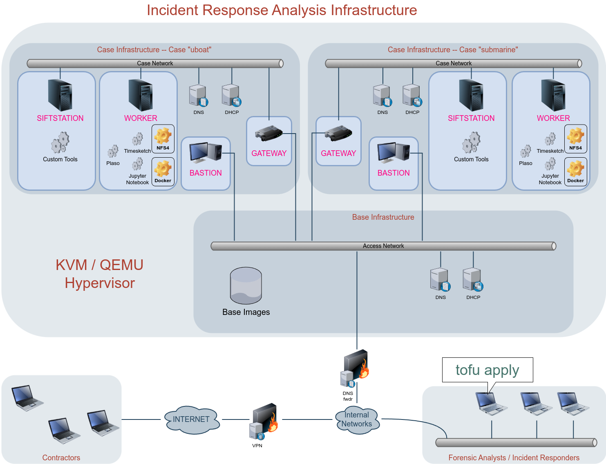

# Incident Response Analysis Infrastructure

An infrastructure as code, written for OpenTOFU / Terraform, based on QEMU/KVM. This project is purely based on OpenSource software.


## Overview



## Quickstart

1. Have a machine ready running KVM
1. Clone this repository
1. Adapt `terraform.tfvars` according to your needs
1. `tofu init && tofu plan && tofu apply`
1. URLs and other means how to access your infrastructure will be displayed after the infrastructure was spawned.

## Further Development

This project is in its early stage and therefore must be considered constant work-in-progress. Below is a sketch of what is planned next.

### Roadmap

1. Split the Terraform code into two modules:
   - One module should create the base infrastructure such as networks, pools, base images and the Bastion host (exactly 1 configuration instance).
   - The other module should set up one to many case-specific analysis environments on top of the base infrastructure (1..n configuration instances).
1. Create services / scripts to automate imports and exports from Plaso to Timesketch.
1. Integrate [DFIR Iris](https://www.dfir-iris.org/) into the per-case infrastructure.
1. Decrease the time-to-ready when spawning a case infrastructure. As of now, it would take around 30 minutes, mainly, because of `pipx install plaso`.
1. Develop and integrate means to analyze and visualize NetFlow data.

### Bugs

- Find a way to combine the case ID with the name of case instances to make them distiguishable for OpenTOFU / Terraform. As of now, only one case infrastructure can be spawned because of name/id collisions.
- Bastion host and Access Network still share the same IP range. Thus, gateways would diretly be accessible by the "outside world". Bastion host services should be the only services which are initially accessible.
- The Timesketch Notebook template is buggy. It lacks certain functions to extract data from the XML part of EVTX logs.
- The siftstation (_not_ to be confused with the SANS Sift Station) does mount the writable NFS share read-only. A workaround is to just reboot the host or issue:
    ```
    mount -o remount,rw /data/read-write /data/read-write
    ```
